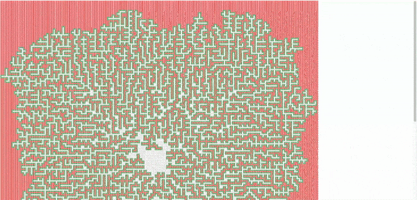
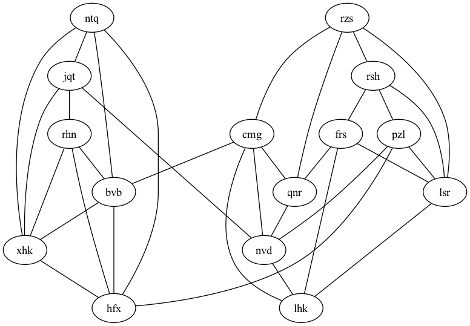

# My Advent of Code Solutions 🎄

 Here, you'll find my solutions to the [Advent of Code](https://adventofcode.com/) puzzles, where I battled against elves, snowmen, and CPU cycles to solve coding challenges faster than Santa's sleigh on Christmas Eve.

## Highlights 🌟

## Day 10: Pipe Maze 🏞️

The challenge? The main task is to identify the longest path from a starting point within a continuous loop of pipes, measured in steps. The secondary task is to calculate the number of tiles enclosed within this loop. The challenge requires analyzing pipe layouts and determining connectivity and distances within the grid.

I appreciate the concept of enlarging the grid to accurately identify and calculate the tiles that are enclosed within the boundaries of this pipe loop.

[Check out the code for Day 14](./day_10_task.py)

## Day 25: Snowverload 🏞️

Graph visualization can be an exceptionally useful tool, even for managing large datasets. Graphviz stands out as a particularly impressive tool for this purpose, offering robust functionality and versatility.

## Running the Code 🏃

Want to join in on the festive fun? Follow these reindeer tracks:

1. Clone the repository: `git clone git@github.com:dmshirochenko/aoc_2023.git`
2. Run the solution with the magic word: `python day-xx_task.py`

## Happy Holidays! 🎉

Feel free to poke around, and may your holiday season be filled with joy, laughter, and zero code bugs!

---

_Special thanks to the elves at Advent of Code for making every December a coding adventure!_
